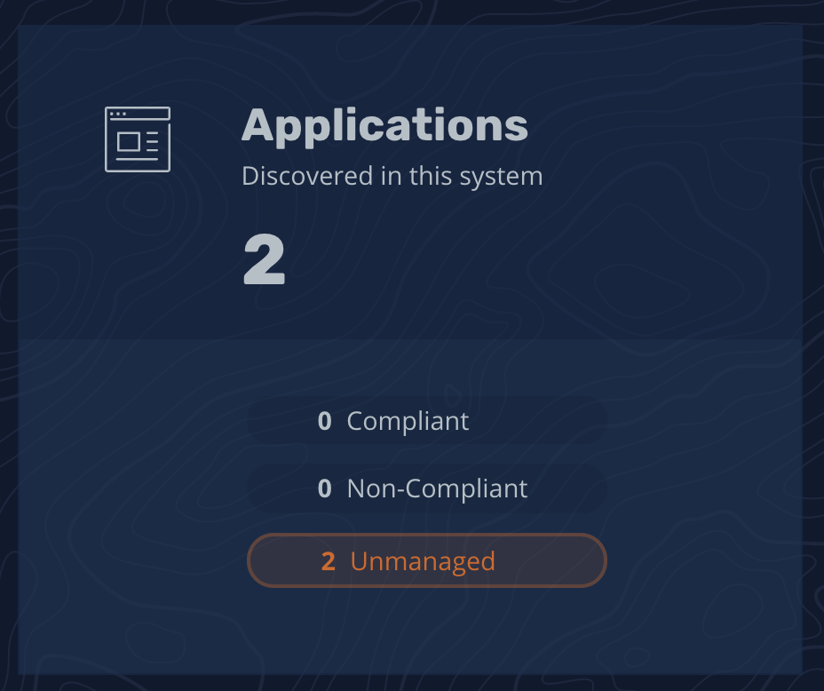
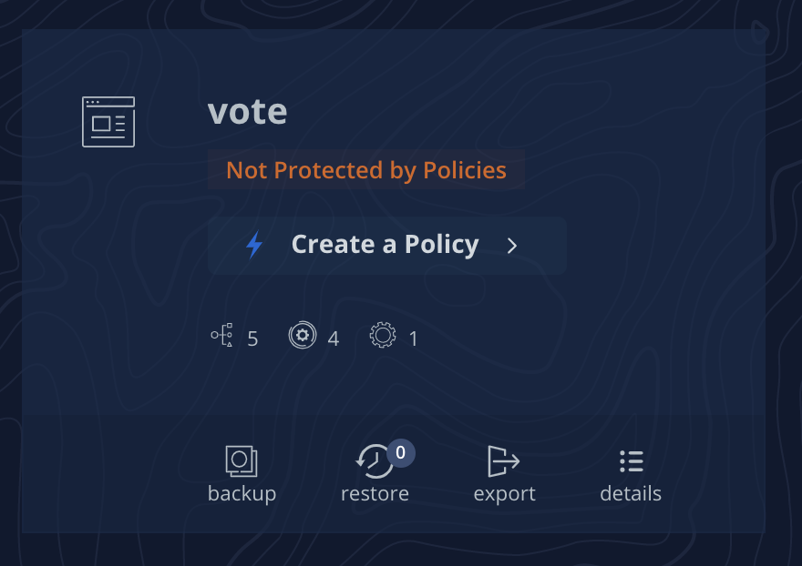
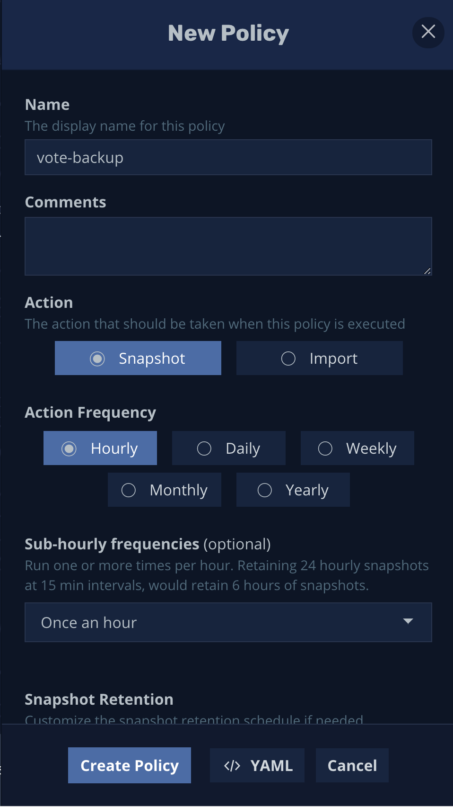

# Create backup policy in K10

in the “K10 Dashboard” you should see the vote application, we are going to create a policy to back up the application.

click on Applications

and click on "Create a Policy" to backup application

We don't need to do anything with the policy, we will be backingup all resource in the `Vote` application, which we will explore in more detail a little later.

## Policy Customization
The policy can be customized to change backup frequency, backup retention, or even be selective about what will be backedup.

(maybe explain why this matters, can differenciate between critical data vs non-critical data)

## Data Mobility
You can even export to an external storage location to keep multiple copies of your backup. Right now we just need to click "Create Policy" at the bottom.

(explain capacity here for CI/CD, dev clusters, cloud mobility, etc ...)

